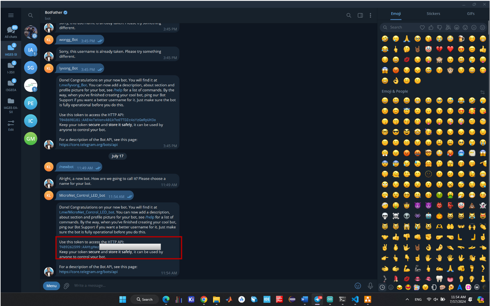

# 1. Description of Micro:Net
The MicroNet PCB Board featuring the ESP32-S3 is a powerful and efficient platform designed for educational and practical applications in IoT, AI, and embedded systems. Its advanced features and compact design make it an ideal choice for developers, hobbyists, and educators looking to explore and innovate in the fields of electronics. This all-in-one educational package encourages assembly, fosters STEM skills, and offers a comprehensive introduction to robotics, electronics, and potential programming for all of generations to gain more knowledges.

# 2. Micro:Net library for Arduino IDE
    - BlinkLED
    - Button
    - Buzzer
    - RGB
    - TelegramControl
# 3. BlinkLED
You can go to example of MiorcoNet libray then click on BlinkLED

In this example we set the LED1 to pin 5 and LED2 to pin 6 according to the MicroNet board. You also can change to another pins as possible.

# 4. Button

On the Micro:Net board, it has 2 user buttons that use GPIO01 and GPIO02.

In this example, we use Button1 to light up the LED1 (GPIO05) and Button2 to light up LED2 (GPIO06). Button1 was pressed the LED1 will light up until we press it again then the LED state is  low and the concept of Button2 is the same.

# 5. Buzzer
In order to alert the buzzer on board, you can go to example then click on Buzzer.

The buzzer pin on board is pin GPIO07, you be able to change the pin in order to use with other applications.

# 6. RGB

On Micro:Net board, it has 2 RGBs model WS2812B that blink as a rainbow color.

RGBs on board is connencted to GPIO04.

# 7. Telegram Control LED on Board
In this example, we will shown about how to implememt Telegram Bot with Micro:Net.

You need to initial : 

- SSID : Your Wi-Fi's name 

    Example : My WiFi's name is "wong" then it will be const char* ssid = "wong";

- password : Your Wi-Fi's password

    Example : My WiFi's password is "12345678" then it should be const char* password = "12345678";

- botToken : YOUR_BOT_TOKEN
    Example : My botToken is "7048698101:AAE-------" then it should be const char* password = "12345678";

- chatID : YOUR CHAT ID 
    Example : My botToken is "123------" then it should be const char* password = "123----";

# 8. How to Create Telegram Bot ?
Follow these step to create Telegram Bot 

- Step1 : Go to telegram then search "BotFather"

- Step2 : Then write command "/newbot"

- Step3 : Set the name of telegram bot then copy the API to past on botToken.
Note: Don't share your Bot API with others.

- Step4 : Go to search IDBot then write command "/start" and it will give us an random ID. Then copy it in order to past in "chatID".

- Step5 : Just use these command to control the LED and check the state of LED in your telegram Bot.

